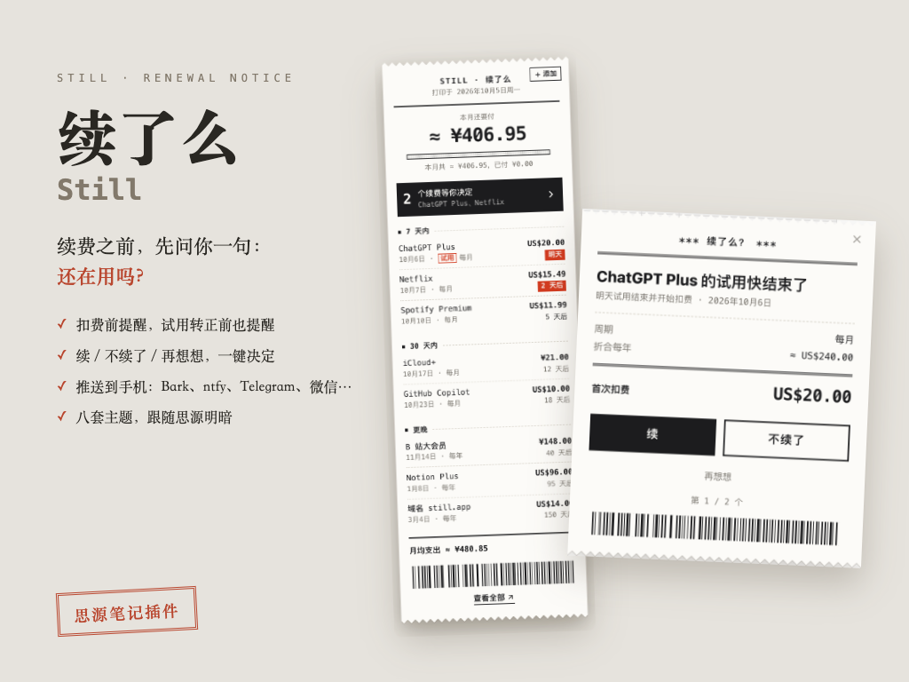

# Still · 续了么

Subscription tracker that asks before it renews. SiYuan plugin first; Obsidian,
self-hosted server (Docker) and mobile clients later.



User docs: [English](apps/siyuan/README.md) · [中文](apps/siyuan/README.zh-CN.md) · [Changelog](CHANGELOG.md)

## Layout

```
packages/core     Platform-independent domain logic (no DOM, no Intl, no crypto):
                  calendar dates, billing cycles, money, HLC timestamps,
                  reminders, file-per-record repository. Runs in goja.
packages/engine   The service every host runs: owns reads/writes, schedules
                  reminders, claims them across devices, pushes, writes daily
                  notes. Hosts plug in storage, HTTP, timers and events.
packages/ui       React + shadcn/ui views shared by every host. Tailwind classes
                  are prefixed `still:`; no global preflight. Eight themes render
                  one superset markup (`stl-*`) styled per theme with @scope.
apps/siyuan       SiYuan plugin: kernel.js (goja; runs the engine behind RPC) and
                  index.js (frontend: dock, tab, status bar, reminder card).
apps/obsidian     Obsidian plugin: main.js runs the engine in-process over a vault
                  folder (default `Still/`); sidebar, manager tab, settings tab.
                  Its CSS is lifted one id of specificity above Obsidian's
                  element styles at build time.
tools/goja-runner Runs JS in the same goja setup SiYuan uses, for tests.
```

## Commands

```bash
pnpm install
pnpm test        # core unit tests + kernel.js end-to-end in real goja (needs Go)
pnpm typecheck
pnpm build       # apps/siyuan/dist + apps/siyuan/package.zip
```

Develop against a dedicated SiYuan workspace (needs SiYuan 3.8.5+ installed; the
script uses its kernel binary, trusts bazaar plugins and turns update downloads off):

```bash
pnpm --filter @still/siyuan dev                     # rebuild on change
node apps/siyuan/scripts/serve.mjs                  # kernel on :6899, workspace ~/SiYuan/still-dev
node apps/siyuan/scripts/seed.mjs --reset           # demo data
node tools/snap/snap.mjs /tmp/snaps                 # Playwright screenshots for visual QA
```

Or link `dist/` into an existing workspace with `node apps/siyuan/scripts/link.mjs <workspace>`.

Tutorial clips live in `docs/tutorial/clips/` and are recorded with the
make-kmind-tutorial-slice-lite pipeline against the dev kernel.

## Design notes

- **The kernel plugin is the single writer.** The frontend calls it over
  JSON-RPC (`apps/siyuan/src/shared/rpc.ts`); it broadcasts `changed` and
  `reminders-due`. Reminders are computed even when no window is open.
- **One file per subscription** under `data/storage/petal/still/subscriptions/`,
  so SiYuan's file-level sync behaves like per-record last-writer-wins.
  Deletes are tombstones. `updatedAt` is a hybrid logical clock string, ready
  for a sync server.
- **Dates are civil dates** (`YYYY-MM-DD`), never instants. Month cycles are
  computed from the anchor (Jan 31 → Feb 28 → Mar 31). The kernel uses the
  host time zone; Docker deployments should set `TZ`.
- **Reminders** collapse missed thresholds into the most urgent one, wait for
  `notifyAt` on the day, and are claimed atomically so only one window shows
  each one. Delivery logs are per device (`delivered/<deviceId>.json`).
