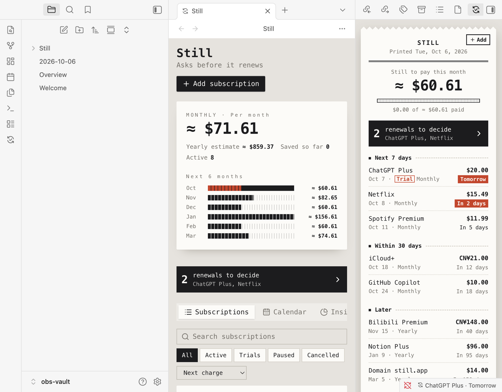

# Still · 续了么

> Before it renews, Still asks: **still using it?**

Still keeps track of your subscriptions and free trials, inside the notes app you already use. Before each charge it shows a card — **keep**, **cancel**, or **decide later** — one click. Available for **Obsidian** and **SiYuan**.

[中文说明](README.zh-CN.md) · [Changelog](CHANGELOG.md) · [Developing](docs/development.md)



## Features

- **Reminders before every charge** — 3 days and 1 day ahead by default, and before free trials convert; same-day reminders wait for your notify time.
- **The "still using it?" card** — what this charge costs and roughly how much you've paid so far. "Cancel it" marks the subscription cancelled, with Undo and a shortcut to the provider's cancellation page.
- **Push to your phone** — Bark, ntfy, Telegram, Server酱 (WeChat), WeCom, DingTalk, Feishu, Discord, Slack, Gotify or any webhook.
- **A sidebar that answers "what's next?"** — what's left to pay this month, decisions waiting for you, upcoming charges; the status bar shows the next one.
- **Manager** — monthly and yearly spend, savings, six-month forecast, calendar and category insights.
- **90+ services** with brand icons; multi-currency totals combined with exchange rates.
- **Eight themes** — five receipt styles (Thermal, Boutique, Ticket, Riso, Swiss) plus Calm, Wallet and Timeline — each in light and dark, following your app.
- **Lives in your notes** — daily-note entries for charges and cancellations, and a live overview table in any note.
- **Your data stays yours** — plain JSON files in your vault or workspace, synced however you sync it; JSON export and import, and the same format in both apps.

## Obsidian

Install from **Settings → Community plugins → Browse**, search for "Still". Requires Obsidian 1.8.7 or later; works on desktop and mobile.

- Open the sidebar with the ribbon icon or the command **Still: Open upcoming charges**; **Still: Open subscriptions** opens the manager in a tab.
- Data is kept in the vault folder `Still/` (one JSON file per record); rename or move it in **Settings → Still**, and the data moves with it.
- Put a live table of upcoming charges in any note:

  ````markdown
  ```still
  days: 30
  limit: 10
  ```
  ````

  Both lines are optional. **Still: Insert subscription overview** inserts a static table instead.
- **Daily notes** — turn on "Write to daily note" in Still's settings; entries go into today's note using your Daily notes settings (folder, date format, template).
- **Markdown notes** (optional, in Settings → Still) — one note per subscription in `Still/Notes`, with its details as properties, plus a `Subscriptions.base` view. Still maintains these notes; change subscriptions in Still.
- Obsidian has no background process, so reminders and pushes happen while Obsidian is open on any of your devices; anything missed is caught up the next time it starts. If several devices sync the vault, pick one as the sender in Settings → Notifications.

## SiYuan

Install from **Bazaar → Plugins**, search for "Still" or "续了么". Requires SiYuan 3.8.5 or later. Reminders are computed by a kernel plugin, so they're scheduled and pushed even with every window closed. See the [SiYuan guide](apps/siyuan/README.md) for the dock, the `/still` overview table and the AI agent tool.

## Privacy

Apart from push channels you configure, Still only calls public exchange-rate APIs (open.er-api.com / Frankfurter; turn conversion off in Settings to stop). Your subscription data is never uploaded.

## License

MIT © suka233
